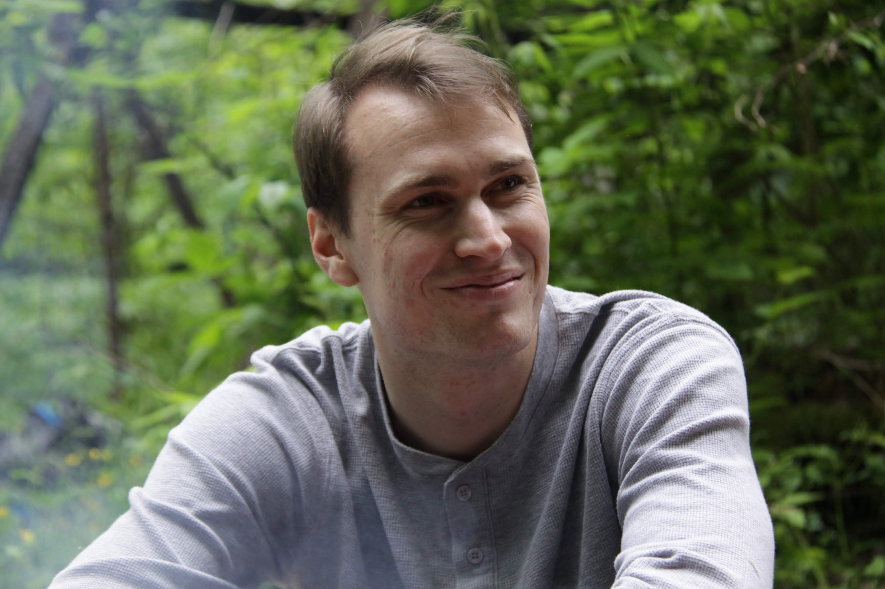

```{r picture, out.width = "50%",out.extra='style="float:left; padding:15px"',echo=FALSE}

```

I have spent the last year diving deep into People Analytics, with an extra focus on Talent Acquisition, but I am now looking for my next opportunity to learn and grow. I'm taking my expertise with data analytics, mostly using R and Tableau, and hoping to find a position that will allow me to use my background in decision sciences. To me, this means being able to lead discussions about decision criteria, metric creation, and methods of data collection. My goal is to help people realize the difference between data-driven and data-inspired to choose their best course of action.

Beyond my academic and professional aspirations, I am an ever curious individual always trying to explore and master new skills. Looking through this website, you'll find photos from my adventures traveling the world and experiencing new cultures. Wherever I end up in life I hope to pursue my passions and hobbies including soccer, baking, and photography.
