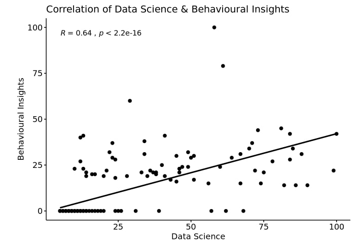

#[Check out my github](https://github.com/jpean)

## Trends for Behavioral and Data Science

[{width=500px}](https://jpean.github.io/522-Final-Project)

Pulling data from Google Trends I looked at the relationship of different key behavioral and data science terms over time. 

## PUBg Predictive Analytics: Machine Learning

[{width=500px}](https://drive.google.com/file/d/1heD3FAqFJeV9rtyDCebiL69ksoksmPoc/view?usp=sharing)

## Sample Shiny App: New York Times Best Sellers

[{width=400px}](https://jpean.shinyapps.io/the-app/)

*More Coming Soon*
